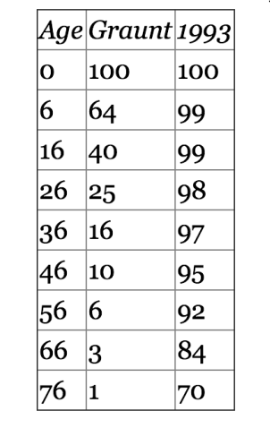
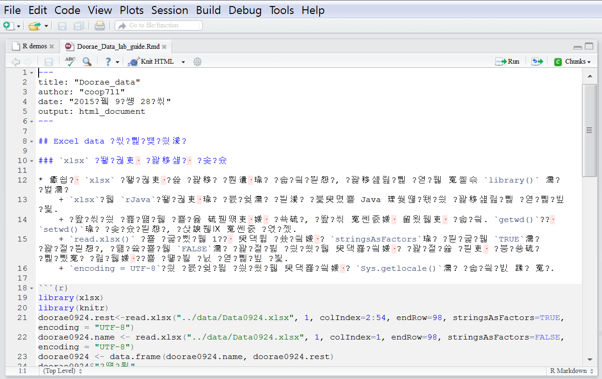
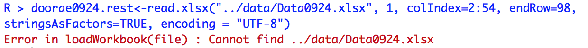
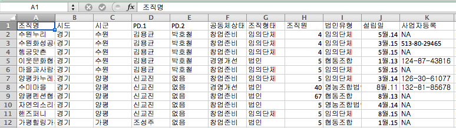
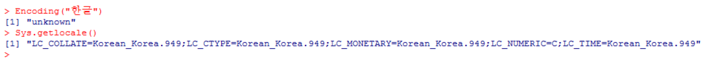

### 생명표와 관련 문제

#### 1. Graunt와 1993년 미국(9점)



##### 1.1 다음 자료 입력의 결과로 생겨나는 `graunt` data frame에 적용한 함수들의 출력으로 옳지 않은 것은?

```{r, Graunt and US93, results='hide'}
(graunt <- data.frame(x = c(0, 6, 16, 26, 36, 46, 56, 66, 76), lx.17th = c(100, 64, 40, 25, 16, 10, 6, 3, 1)))
```

가. `is.vector(graunt)` : `[1] FALSE`

나. `is.data.frame(graunt)` : `[1] TRUE`

다. `is.matrix(graunt)` : `[1] TRUE`

라. `is.list(graunt)` : `[1] TRUE`


##### 1.2 같은 연령대에 속하는 1993년 미국인들의 생명표를 다음과 같이 입력하고자 한다. `names(us.93)`의 결과로 옳은 것은?

```{r, US 93 lifetable, results='hide'}
(us.93 <- data.frame(x = graunt$x, lx.93 = c(100, 99, 99, 98, 97, 95, 92, 84, 70)))

```

가. `r names(us.93)`

나. `r names(graunt)`

다. `r names(us.93)[2]`

라. `r names(graunt)[2]`


##### 1.3 두 자료를 합쳐서 하나의 데이터프레임으로 만들었다. 다음 중 그 결과가 다르게 나오는 것은?

```{r, graunt and US93, results='hide'}
(graunt.us <- data.frame(graunt, lx.93 = us.93$lx))
```

가. `us.93$lx`

나. `us.93$lx.93`

다. `us.93["lx.93"]`

라. `us.93[, "lx.93"]`

----

----

----

----

----

----

----

----

----

----

----

----

----

#### 2. 다음은 Graunt의 생명표로부터 작성한 생존도표와 관련코드이다. (15점)

```{r, polygon data, echo=FALSE, results='hide'}
(n.size <- length(graunt$x))
(graunt.x.old <- c(graunt$x, rev(graunt$x)))
(graunt.y.old <- c(rep(0, n.size), rev(graunt$lx.17th)))
(graunt.x <- c(0, graunt$x, graunt$x[n.size], 0))
(graunt.y <- c(0, graunt$lx.17th, 0, 0))
```

```{r, Graunt life distribution, fig.width=4.5, fig.height=4.5, echo=FALSE}
plot(graunt$x, graunt$lx.17th, ann = FALSE, xaxt = "n", yaxt = "n", type = "b")
axis(side=1, at=graunt$x, labels=graunt$x)
axis(side=2, at=graunt$lx.17th, labels=graunt$lx.17th)
abline(v=c(0, 76), lty=2)
polygon(graunt.x, graunt.y, density=15)
abline(v=graunt$x, lty=2)
title(main="John Graunt의 생존 곡선", xlab="연령(세)", ylab="생존률(%)")
```


```{r, Graunt life distribution 2, fig.width=4, fig.height=4, fig.show='hide'}
plot(graunt$x, graunt$lx.17th, ann = FALSE, xaxt = "n", yaxt = "n", type = "b")
axis(side=1, at=graunt$x, labels=graunt$x)
axis(side=2, at=graunt$lx.17th, labels=graunt$lx.17th)
abline(v=c(0, 76), lty=2)
polygon(graunt.x, graunt.y, density=15)
abline(v=graunt$x, lty=2)
title(main="John Graunt의 생존 곡선", xlab="연령(세)", ylab="생존률(%)")
```

##### 2.1 `polygon()`을 그리는데 필요한 좌표들을 검토해 보니 보다 간단히 할 수 있게 되어 예전에 사용한 좌표들은 이름을 변경하여 저장하고 새로운 좌표들을 사용하려 한다. 옛 좌표들과 새로이 작성한 좌표들 간에 차이를 확인하기 위하여 `length()`를 적용하였다. 그 결과로서 옳지 않은 것은?

```
(n.size <- length(graunt$x))
(graunt.x.old <- c(graunt$x, rev(graunt$x)))
(graunt.y.old <- c(rep(0, n.size), rev(graunt$lx.17th)))
(graunt.x <- c(0, graunt$x, graunt$x[n.size], 0))
(graunt.y <- c(0, graunt$lx.17th, 0, 0))
```

가. `n.size` : `r n.size`

나. `length(graunt.x.old)` : `r length(graunt.x.old)`

다. `length(graunt.y.old)` : `r length(graunt.y.old)`

라. `length(graunt.x)` : `r length(graunt.x)`

마. `length(graunt.y)` : `r length(graunt.y.old)`


##### 2.2 도표를 그리기 위한 `plot()` 함수 안에서 `ann = FALSE` 를 설정하지 않는다면 무엇이 달라지겠는가?

가. x축의 라벨만

나. y축의 라벨만 

다. x축, y축의 라벨 둘 다 

라. 아무 영향 없음.

##### 2.3 결과적으로 수행하지 않아도 되었을 코드는 다음 중 어느 것인가?

가. `axis(side=1, at=graunt$x, labels=graunt$x)`

나. `axis(side=2, at=graunt$lx.17th, labels=graunt$lx.17th)`

다. `abline(v=c(0, 76), lty=2)`

라. `abline(v=graunt$x, lty=2)`

##### 2.4 빗금친 부분의 면적은 다음 중 무엇을 나타내는가?

가. 기대수명

나. 중위수명

다. 최대수명

라. 영아사망률 

##### 2.5 빗금친 부분의 면적을 계산하기 위하여 `area.R()`이라는 함수를 작성하였다. 이 함수를 이용하여 Graunt 생명표의 기대수명을 대략 계산할 때 올바른 식은 어느 것인가? 

```{r, area_under_the_curve, results='hide'}
area.R <- function(x, y) {
  sum(diff(x) * (head(y, -1) + tail(y, -1))/2)
  }
```

가. `area.R(graunt$x, graunt$lx.17th)`

나. `area.R(graunt$x, graunt$lx.17th)/100`

다. `area.R(graunt$lx.17th, graunt$x)`

라. `area.R(graunt$lx.17th, graunt$x)/100`


#### 3. 1993년 미국의 생명표와 비교(12점)

```{r, us.y setting, echo=FALSE, results='hide'}
us.y <- c(graunt$lx, rev(us.93$lx.93))
```

```{r, Graunt vs US 1993, fig.width=4.5, fig.height=4.5, echo=FALSE}
plot(graunt$x, graunt$lx.17th, ann=F, xaxt="n", yaxt="n", type="b")
axis(side=1, at=graunt$x, labels=graunt$x)
axis(side=2, at=graunt$lx, labels=graunt$lx.17th)
abline(v=c(0, 76), lty=2)
lines(us.93$x, us.93$lx.93, type="b")
abline(h=70, lty=2)
axis(side=2, at=70, labels=70, las=1)
polygon(graunt.x.old, us.y, density=15, col="red", border=NA)
abline(v=graunt$x, lty=2)
title(main="Graunt와 1993년 미국의 생존 곡선", xlab="연령(세)", ylab="생존률(%)")
```

```{r, Graunt vs US 1993 2, fig.width=4.5, fig.height=4.5, fig.show='hide'}
plot(graunt$x, graunt$lx.17th, ann=F, xaxt="n", yaxt="n", type="b")
axis(side=1, at=graunt$x, labels=graunt$x)
axis(side=2, at=graunt$lx, labels=graunt$lx.17th)
abline(v=c(0, 76), lty=2)
lines(us.93$x, us.93$lx.93, type="b")
abline(h=70, lty=2)
axis(side=2, at=70, labels=70, las=1)
polygon(graunt.x.old, us.y, density=15, col="red", border=NA)
abline(v=graunt$x, lty=2)
title(main="Graunt와 1993년 미국의 생존 곡선", xlab="연령(세)", ylab="생존률(%)")
```

##### 3.1  빗금친 부분의 면적은 무엇을 나타내는가?

가. 기대수명의 차이

나. 중위수명의 차이

다. 최대수명의 차이

라. 영아사망률의 차이

##### 3.2 1993년 미국인의 76세까지 생존률 70%를 점선으로 표시하기 위하여 사용한 코드는 무엇인가?

가. `axis(side=2, at=graunt$lx, labels=graunt$lx.17th)`

나. `abline(v=c(0, 76), lty=2)`

다. `abline(h=70, lty=2)`

라. `abline(v=graunt$x,lty=2)`

##### 3.3 1993년 미국인의 76세까지 생존률 70%를 강조하기 위하여 y축의 눈금 중 70을 수평으로 눕히는 데 사용한 설정은 무엇인가?

가. `lty=2`

나. `las=1`

다. `border=NA`

라. `yaxt="n"`

----

##### 3.4  빗금친 부분의 면적을 계산하기 위하여  `area.R()` 함수를 활용하려 한다. 옳게 입력한 것은? 

가. `area.R(us.93$x, us.93$lx.93) - area.R(graunt$x, graunt$lx.17th)`

나. `area.R(us.93$x, us.93$lx.93)/100 - area.R(graunt$x, graunt$lx.17th)/100`

다. `area.R(graunt$x, graunt$lx.17th) - area.R(us.93$x, us.93$lx.93)`

라. `area.R(graunt$x, graunt$lx.17th)/100 - area.R(us.93$x, us.93$lx.93)/100`

#### 4. ggplot 으로 그려본다면 (18점)

##### 4.1 `graunt.us`를 `ggplot`에서 작업할 수 있도록 long format으로 바꾸려 한다. `variable`로 들어가게 되는 것은 다음 중 무엇인가?

```{r, reshape2, echo=FALSE, results='hide'}
library(reshape2)
```

```{r, graunt data melt, results='hide'}
(graunt.melt<-melt(graunt.us, id.vars = "x", measure.vars = c("lx.17th", "lx.93"), value.name="lx"))
```


가. `graunt.us`

나. `id.vars = "x"`

다. `measure.vars = c("lx.17th", "lx.93")`

라. `value.name="lx"`


##### 4.2 `times` factor의 각 label은 내부적으로 어떻게 기억는가?

```{r, times factor, results='hide'}
graunt.melt$times <- factor(graunt.melt$variable, labels = c("17th", "1993"))
```

가. `17th` : 0, `1993` : 1

나. `17th` : 1, `1993` : 2

다. `17th` : 1, `1993` : 0

라. `17th` : 2, `1993` : 1


```{r, ggplot2, echo=FALSE, results='hide'}
library(ggplot2)
```

##### 4.3 다음은 한글 theme을 설정하는 코드이다. `ggtitle()`에 활용되는 항목은 무엇인가?

```{r, theme_kr, results='hide'}
theme.kr <- theme(axis.title.x = element_text(family = "HCR Dotum LVT"),
                  axis.title.y = element_text(family = "HCR Dotum LVT"),
                  axis.text.x = element_text(family = "HCR Dotum LVT"),
                  axis.text.y = element_text(family = "HCR Dotum LVT"),
                  plot.title = element_text(family = "HCR Dotum LVT"),
                  legend.title = element_text(family = "HCR Dotum LVT"),
                  legend.text = element_text(family = "HCR Dotum LVT"))
```

가. `axis.title.x = element_text(family = "HCR Dotum LVT")`

나. `axis.text.x = element_text(family = "HCR Dotum LVT")`

다. `plot.title = element_text(family = "HCR Dotum LVT")`

라. `legend.title = element_text(family = "HCR Dotum LVT")`

*  다음은 ggplot으로 그려가는 과정과 결과물이다.

```{r, ggplot plotting stages, results='hide'}
g1 <- ggplot(graunt.melt, aes(x = x, y = lx, colour = times)) + geom_point()
g2 <- g1 + geom_line()
g3 <- g2 + theme_bw()
g4 <- g3 + theme.kr +
   xlab("연령") + ylab("생존률(%)") +
   ggtitle("Graunt 시대와 1993년 미국의 생존함수 비교") +
   labs(colour="시기") +
   scale_colour_discrete(labels = c("Graunt 시대", "1993년 미국"))
g5 <- g4 + theme(legend.position = c(0.8, 0.5))
```

```{r, ggplot final stage, fig.width=5, fig.height=5}
(g6 <- g5 + scale_x_continuous(breaks=graunt$x) + scale_y_continuous(breaks=graunt$lx.17th)
   )
```

##### 4.4 `g4` 에서 `scale_colour_discrete`를 설정하지 않으면 범례는 어떻게 바뀌었을까?

가. `17th`, `1993`

나. `lx.17th`, `1x.93`

다. `1993`, `17th`

라. `lx.93`, `lx.17th`

##### 4.5  범례를 도표 안쪽으로 들어오게 한 코드는 무엇인가?

가. `scale_colour_discrete(labels = c("Graunt 시대", "1993년 미국"))`

나. `aes(x = x, y = lx, colour = times)`

다. `theme(legend.position = c(0.8, 0.5))`

라. `labs(colour="시기")`

##### 4.6 theme_bw() 와 theme.kr의 순서가 바뀌면 어떤 일이 벌어지겠는가?

가. 한글이 나타나지 않는다.

나. 회색 배경이 나타난다.

다. 흑백 배경이 없어진다.

라. 차이가 없다.

----

----

----

----

----

----

----

----

----

----

----

----

----

----

----

----

----

----

----

----

----

### Doorae 자료 클리닝

#### 5. RStudio에서 엑셀 자료 읽어들이기. `xlsx` 패키지 설치와 활용 (36점)

##### 5.1 RStudio에서 불러들었더니 다음 화면이 출력되었다. 필요한 조치는?



가. File > Reopen with Encoding >

나. RStudio 재설치

다. File > Save with Encoding > 

라. R 최신판 재설치 

##### 5.2 `xlsx` 패키지의 설치와 등록 과정에서 다음과 같은 에러 메시지를 받았을 때 적절한 조치는 다음 중 무엇인가?


가. `xlsx`패키지지를 다시 설치한다.

나. 플랫폼에 맞는 Java를 설치한다.

다. `rJava` 패키지를 다시 설치한다.

라. 시스템을 다시 부팅한다.

##### 5.3 다음과 같은 에러 메시지가 출력되었을 때 작업 디렉토리를 확인하기 위하여 수행하는 함수는 무엇인가?



가. `setwd()`

나. `getwd()`

다. `list.files()`

라. `ls()`

##### 5.4 읽어들이고자 하는 엑셀 자료의 일부를 보고, 다음 코드에서 앞부분은 `stringsAsFactors=TRUE`로 설정하고, 뒷부분은  `stringsAsFactors=FALSE`로 설정한 이유는 무엇인가?



```{r, data reading, echo=FALSE, results='hide'}
library(xlsx)
library(knitr)
```

```{r, data input second part, results='hide'}
doorae0924.rest<-read.xlsx("../data/Data0924.xlsx", 1, colIndex=2:54, endRow=98, stringsAsFactors=TRUE, encoding = "UTF-8")
doorae0924.name <- read.xlsx("../data/Data0924.xlsx", 1, colIndex=1, endRow=98, stringsAsFactors=FALSE, encoding = "UTF-8")
```

가. 모든 character 변수들을 factor로 설정하기 위하여

나. 모든 factor변수들을 character로 설정하기 위하여

다. 조직명을 제외한 모든 character 변수들을 factor로 설정하기 위하여

라. 조직명을 제외한 모든 factor변수들을 character로 설정하기 위하여

##### 5.5 다음 코드의 수행결과는 어느 설정의 필요성을 얘기하는가?



가. `colIndex=2:54`

나. `endRow=98`

다. `stringsAsFactors=FALSE`

라. `encoding = UTF-8`

```{r, dataframe combined, echo=FALSE, results='hide'}
doorae0924 <- data.frame(doorae0924.name, doorae0924.rest)
```

##### 5.6 다음 출력 결과에서 전북이 두 개 나오는 이유를 알아내고, 수정하기 위하여 수행한 다음 코드로부터 해당되는 시도명과 조직명을 동시에 파악하려면 어떻게 하여야 하는가?? 

```{r, factor region print out}
doorae0924$"시도"
(id.to.fix <- which(doorae0924$"시도"=="전북 "))
doorae0924$"조직명"[id.to.fix]
```

가. `doorae0924[id.to.fix, c("조직명", "시도")]`

나. `doorae0924[id.to.fix, ("조직명", "시도")]`

다. `doorae0924[c("조직명", "시도"), id.to.fix]`

라. `doorae0924[("조직명", "시도"), id.to.fix]`

##### 5.7 다음 첫 줄과 같이 수정 작업을 했음에도 불구하고, 둘째 줄 코드의 수행 결과에서 볼 수 있다시피 여전히 `"전북 "` 범주가 나오는 문제를 어떻게 해결하여야하는가? 

```{r, zero count level still exists}
doorae0924$"시도"[id.to.fix] <- "전북"
```

```{r, first kable, echo=FALSE}
kable(t(as.matrix(table(doorae0924$"시도"))))
```

가. `doorae0924$"시도" <- factor(doorae0924$"시도")`

나. `doorae0924$"시도" <- levels(doorae0924$"시도")`

다. `relevel(doorae0924$"시도") <- levels(doorae0924$"시도")`

라. `factor(doorae0924$"시도") <- factor(doorae0924$"시도")`


##### 5.8  위의 출력은 `kable()`을 사용한 결과이다. 다음 중 어느 패키지가 위의 `kable()`을 수행하는데 꼭 필요한가?

가. `xlsx`

나. `xtable`

다. `knitr`

라. `ggplot2`

##### 5.9 단순히 `kable(table(doorae0924$"시도"))`를 수행하면 다음과 같은 Error 메시지가 나온다. 제대로 된 출력을 얻으려면?

`Error in dn[[2L]] : 첨자의 허용 범위를 벗어났습니다`

```{r, kable for table, echo=FALSE, results='hide'}
(doorae0924$"시도" <- factor(doorae0924$"시도"))
kable(t(as.matrix(table(doorae0924$"시도"))))
```

가. `kable(as.matrix(table(doorae0924$"시도")))`

나. `kable(t(as.matrix(table(doorae0924$"시도"))))`

다. `kable(matrix(table(doorae0924$"시도")))`

라. `kable(t(matrix(table(doorae0924$"시도"))))`


##### 5.10 업력(years in business)을 계산하기 위하여 `"설립일"` 변수의 class를 알아보니까 `Date`로 나왔다. 2015-05-31 현재, 업력을 계산하여 *연 단위의 수치*로 환산하는 코드로서 적절한 것은?

가. 'difftime("2015-05-31", doorae0924$"설립일", units="days")'

나. 'difftime("2015-05-31", doorae0924$"설립일", units="days")/365'

다. 'as.numeric(difftime("2015-05-31", doorae0924$"설립일", units="days"))'

라. 'as.numeric(difftime("2015-05-31", doorae0924$"설립일", units="days"))/365'

```{r, data cleaning, echo=FALSE, results='hide'}
str(doorae0924)
years.in.business <- round(as.numeric(difftime(Sys.Date(), doorae0924$"설립일", units="days"))/365, digits=1)
str(years.in.business)
head(years.in.business)
doorae0924$"업력" <- years.in.business
str(doorae0924)
```

##### 5.11 `"사업자등록"`에 나오는 NA는 결국 등록을 마치지 못한 것으로 보아야 하며, 개개의 등록번호를 모두 factor level로 보기보다는 등록여부에 따라  `"Yes"`, `"No"`로 분류해 주는 것이 바람직함. 관행상 `"Yes"`가 `"No"`보다 먼저 나와야 하나 알파벳 순으로는 `"No"`가 먼저임. 이를 감안하여 새로운 변수 `"사업자등록여부"`를 생성하되, `"등록"`, `"미등록"`으로 출력하기에 적절한 코드는?

가. `doorae0924$"사업자등록여부" <- ifelse(doorae0924$"사업자등록" == "NA", "No", "Yes")`

나. `doorae0924$"사업자등록여부" <- factor(ifelse(doorae0924$"사업자등록" == "NA", "No", "Yes"))`

다. `doorae0924$"사업자등록여부" <- factor(ifelse(doorae0924$"사업자등록" == "NA", "No", "Yes"), levels=c("Yes", "No"))`

라. `doorae0924$"사업자등록여부"<-factor(ifelse(doorae0924$"사업자등록"=="NA","No","Yes"),levels=c("Yes","No"),labels=c("등록","미등록"))`


```{r, registration data adjustment, echo=FALSE, results='hide'}
(doorae0924$"사업자등록여부" <- factor(ifelse(doorae0924$"사업자등록" == "NA", "No", "Yes"), levels=c("Yes", "No"), labels=c("등록", "미등록")))
```

##### 5.12 `"공동체상태"`의 경우 `"경영개선"`과 `"창업준비"`의 두가지 범주를 갖는데, `"경영개선"`이 가나다 순으로 앞서기 때문에 factor level에서 앞에 오게 된다. 발전 순서에 따라 `"창업준비"`를 앞에 오게 하고 영문 변수명 `status`를 붙이며,  `"업력"`을  `years`라는 영문 변수명으로 하는 data frame으로 재구성하는 코드를 적절히 나타낸 것은?

가. `data.frame(doorae0924$"공동체상태", doorae0924$"업력")`

나. `data.frame(factor(doorae0924$"공동체상태", levels=c("창업준비", "경영개선")), doorae0924$"업력")`

다. `data.frame(status=factor(doorae0924$"공동체상태", levels=c("창업준비", "경영개선")), years=doorae0924$"업력")`

라. `data.frame(factor(doorae0924$"공동체상태", levels=c("창업준비", "경영개선")), years=doorae0924$"업력")`


```{r, status and years, echo=FALSE, results='hide'}
doorae0924.ys <- data.frame(status=factor(doorae0924$"공동체상태", levels=c("창업준비", "경영개선")), years=doorae0924$"업력")
```

* *10점은 기본*으로 주어짐.